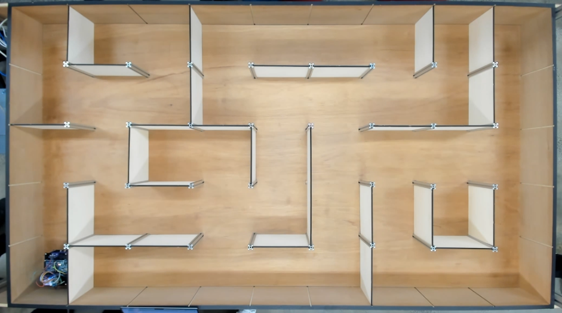
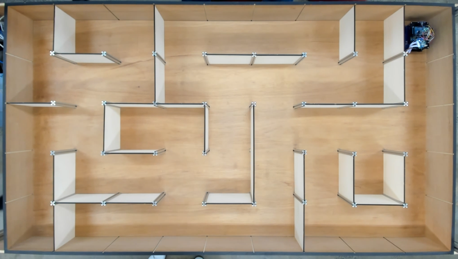

# Micromouse Maze Solving Robot 🤖

This project was developed as part of the **MTRN3100** course by a team of 4 students. Our goal was to design, build, and program an autonomous robot to compete in a **Micromouse maze-solving competition**. Our team achieved the **2nd fastest time** in our cohort during the final competition!

## Project Summary

We developed a two-wheeled autonomous robot capable of:

- Navigating a 9x5 maze grid using onboard sensors and closed-loop control
- Mapping the maze using computer vision from a top-down camera
- Computing and executing the shortest path to the target
- Communicating wirelessly over Bluetooth

The project was divided into several milestones, each building up toward a fully autonomous competition-ready robot.

## Highlights and Learnings

- Learned the importance of early commits and regular communication to avoid last-minute issues, especially when new to Git.
- Gained hands-on experience in C++, particularly in applying DFS for exploration and BFS for shortest path finding.
- Discovered that code alone isn't enough—hardware reliability is often the limiting factor in robotics.
- Applied control system theory, using a moving average filter to clean noisy sensor data.
- Found a strong personal interest in robotics coding and problem-solving, particularly under real-world constraints.
- Realized the value of modular code structure in making debugging and iteration faster.
- Learned to plan for hardware limitations, balancing theoretical algorithms with practical execution.

## Hardware Overview

The robot was built with the following components:

- **Microcontroller**: Arduino Mega
- **Motors**: 2 × 25GA370 motors with encoders
- **Motor Driver**: TB6612
- **IMU**: ICM-20948
- **Distance Sensors**: 3 × VL53L0X (left, front, right)
- **Bluetooth Module**: HC-05
- **Power**: Battery pack with 1.8A fuse and switch

## Software Features

### Basic Functions

- Teleoperated movement (forward, 90° left/right turns)
- Wall detection on all three sides
- Real-time position tracking: `(row, col, heading)`

### Closed-Loop Control

- Odometry and IMU-based motion correction
- Accurate execution of motion plans (e.g. `00SFFLR`)

### Maze Mapping

- Top-down camera image processing using computer vision
- Automatic detection of maze walls
- ASCII-based maze map generation

### Path Planning & Solving

- Shortest path computation to target cell.
- Used DFS to search graph for the target cell
- Used BFS to find the shortest path to the target cell.
- Fully autonomous maze navigation and solving

## Competition Results

- Successfully mapped the maze using top-down vision
- Completed the maze in one of the fastest times
- Placed **2nd in speed** among all student teams

### Our Robot's Starting Position

### Our Robot Completing the Maze

### 🎥 Watch the Robot in Action

You can [download the video of the robot completing the maze](README/robotMazeCompletion.mp4) to see it in motion.

## Team Members

- Vincent Wong
- Jack Adams
- Vincent Zhang
- Ben Crabtree

Each member contributed to hardware design, software implementation, testing, and debugging.

Special Thanks to the staff and tutors of MTRN3100 who guided us and helped us along the way.
